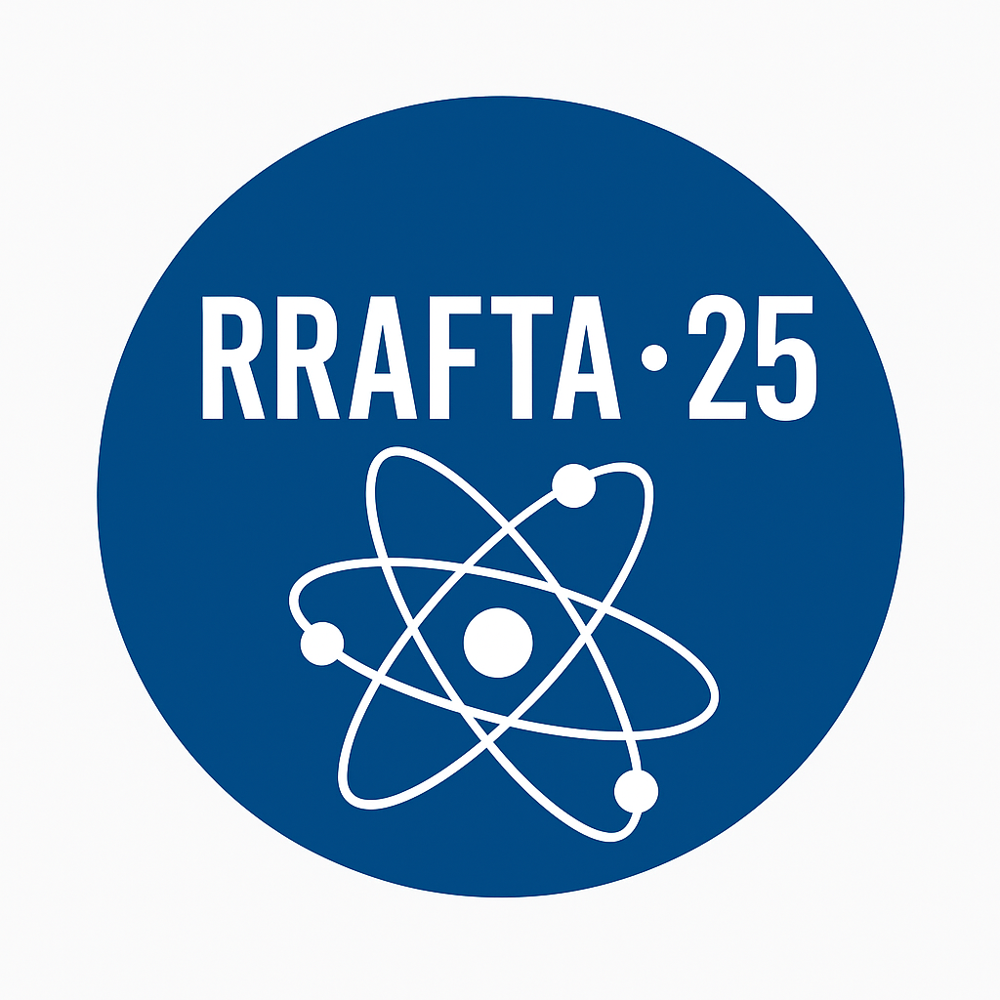
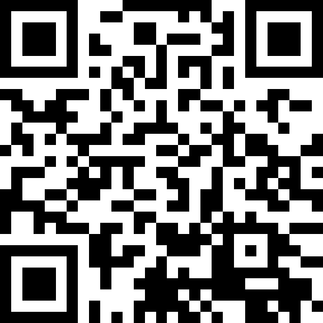
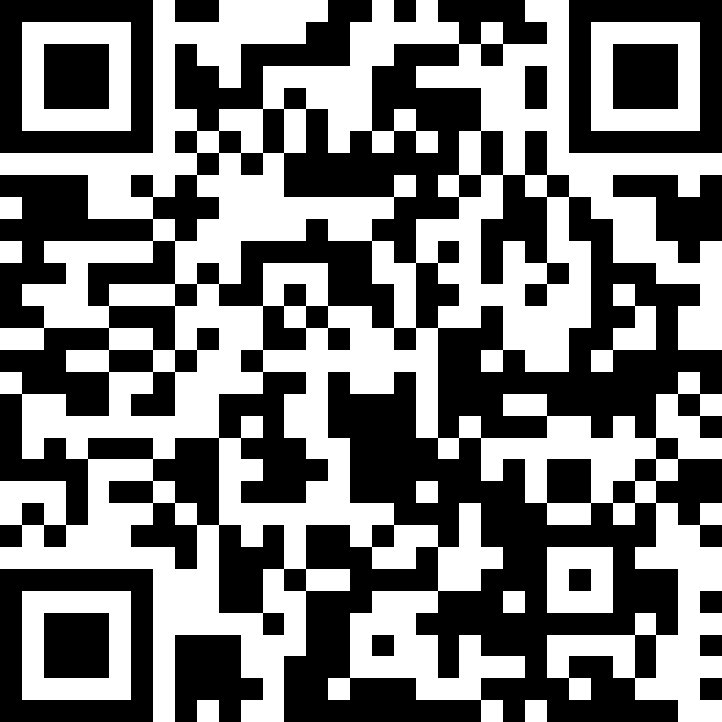
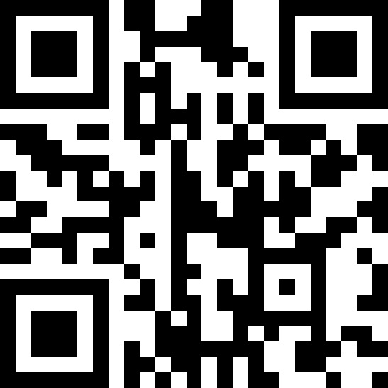

<table style="width:100%; max-width:1000px; border:0;">
<tr>
<td width="55%" align="center">
<h1 style="color:#1f4e79; font-size:36px;">RRAFTA 26</h1>
</td>
<td width="45%" align="right">

</td>
</tr>
</table>

### Reunión Regional Anual de Física, Tecnología y Aplicaciones

Bienvenidos a la **RRAFTA-26**, la Reunión Regional Anual de Física, Tecnología y Aplicaciones del año 2026. Un espacio de encuentro, difusión y colaboración entre estudiantes, investigadores y docentes de nuestra casa y de toda la región.

---

##### 🗓️ Fechas y Lugar

- **Fechas:** del 9 al 11 de junio de 2026
- **Lugar:** Facultad de Matemática, Astronomía, Física y Computación (FaMAF) - Universidad Nacional de Córdoba
- **Horario:** A partir de las 15.00 hs.

---

##### 🔹 Modalidad de Participación
- Participación mediante **presentación de posters** y **asitencia a disertaciones**
- No existe inscripción individual.
- **No tiene costo de participación.**

---

##### 📅 Presentación de Trabajos

- La presentación de los Resumenes de los trabajos científicos, se realizará a través de la Intranet de la Asociación Física Argentina:
  
  - [https://intranet.fisica.org.ar/](https://intranet.fisica.org.ar/)

- Un **investigador responsable** deberá:
  - Crear un usuario en la Intranet, sin asociarse!
  - Subir el **Resumen del Trabajo** (cuerpo del resumen máximo 400 palabras).
  - Indicar las filiaciones
  - Agregar los autores del trabajo
  - Indicar su **dirección de correo electrónico**.

- Al enviar el resumen:
  
  - Se podrá descargar un PDF con la leyenda: “**Sujeto a revisión por parte del Comité Científico de la RRAFTA-26**”.

- **Fecha límite para envío de resúmenes:** 7 de junio de 2026.

--- 

##### 🔄 Proceso de Evaluación

- Luego del cierre de envío de resúmenes, el **Comité Científico** evaluará las presentaciones.

- Los trabajos **aprobados**:
  
  - Podrán descargar su resumen definitivo (sin la leyenda de revisión).
  - Serán informados vía correo electrónico.
  - Recibirán indicación del **número de porta-poster asignado** y la **hora de colocación**.

- Los trabajos aceptados y presentados formarán parte del **Libro de la Reunión**.

##### 📅 Presentación de los Poster.
- A partir de las 17.00 hs de cada día comienza la presentación de los Poster.
- Se solicita que al menos un autor del trabajo esté en el mismo, a los efectos de interactuar con los participantes.

---

##### 📈 Certificados

- El investigador responsable de cada trabajo **aprobado y presentado** podrá descargar automáticamente un **Certificado** desde la Intranet, luego de concluida la RRAFTA 26.

---

##### 🔊 Disertaciones

- Durante los días de la reunión, se llevarán a cabo **disertaciones científicas** en el **Aula Magna de la FaMAF**, a partir de las 15:00 hs.

1. **Karina Chattah**
   > Control de la dinámica espines y su decoherencia por RMN.  
   > 9 de junio, 15 Hs

2. **Noelia Bajales Luna**
   > Diseño, síntesis y simulaciones de nanoestructuras magnéticas para aplicaciones nanotecnológicas.  
   > 9 de junio, 16 hs

3. **Jorge Revelli**
   > Sistemas complejos: Aplicaciones a la sociofisica.  
   > 9 de junio, 17 hs

4. **Sergio Massuelli**
   > Estimacion de precipitacion con sensores remotos.  
   > 11 de junio, 15 hs
   
5. **Cecilia Gimenez**
   > Estudios computacionales de hidrógeno en celdas de combustible.  
   > 11 de junio, 16 hs

1. **Jerónimo Acito Pino**
   > Estudio de espectros y propiedades excitónicas en semiconductores mediante cálculos GW–BSE.  
   > 11 de junio, 17 hs

##### ☕ Servicios Disponibles

- Se dispondrá de **cafetería** durante el evento.

- Se solicita que al menos **un investigador** por poster presentado esté presente en el horario de exposición correspondiente.

---

##### Comisión Organizadora
- Gabriela Grad  - Coordinadora Comité Científico
- Karina Chattah  
- Cecilia Gimenez  
- Carlos Di Prinzio  
- Marcos Oliva  
- Omar Osenda  
- Jerónimo Acito Pino  
- Lucas Montenegro Perlo  
- Luana Ferrero  
- Edgardo Bonzi - Coordinador Comisión Organizadora

##### 📧 Contacto

Coordinador de la Comisión Organizadora: Edgardo Bonzi   
📧 **Correo:** _edgardobonzi@gmail.com_   
📧 **Correo:** _edgardo.bonzi@unc.edu.ar_

---

##### 🔄 Actualizaciones

- Toda información adicional o modificaciones serán comunicadas mediante este espacio y por los canales oficiales de la organización.

| RRAFTA 26- github.com/EdgardoBonzi/RRAFTA-26/| FAMAF - UNC - www.famaf.unc.edu.ar/ UNC                                                                | Intranet AFA   intranet.fisica.org.ar/                                                                          |
|:---------------------------------------------------------------------------------------:|:--------------------------------------------------------------------------:|:----------------------------------------------------------------------------------------:|
|  |  |  |

---

🌟  **¡Los esperamos para compartir ciencia, tecnología e intercambio en la RRAFTA-26!**   🌟
