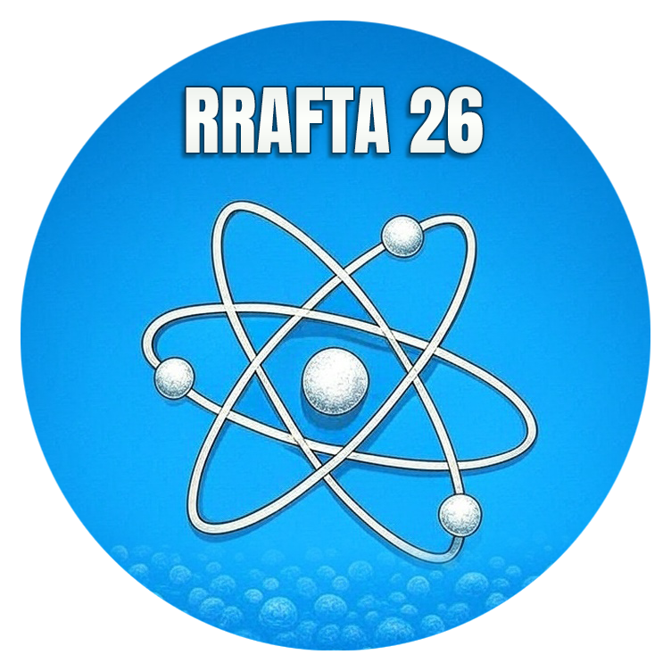

<table style="width:100%; max-width:1000px; border:0;">
<tr>
<td width="55%" align="center">
<h1 style="color:#1f4e79; font-size:36px;">RRAFTA 26</h1>
</td>
<td width="45%" align="right">

</td>
</tr>
</table>

### Reunión Regional Anual de Física, Tecnología y Aplicaciones

Bienvenidos a la **RRAFTA-26**, la Reunión Regional Anual de Física, Tecnología y Aplicaciones del año 2026. Un espacio de encuentro, difusión y colaboración entre estudiantes, investigadores y docentes de nuestra casa y de toda la región.

---

##### 🗓️ Fechas y Lugar

- **Fechas:** del 9 al 11 de junio de 2026
- **Lugar:** Facultad de Matemática, Astronomía, Física y Computación (FaMAF) - Universidad Nacional de Córdoba
- **Horario:** A partir de las 15.00 hs.

---

##### 🔹 Modalidad de Participación
- Participación mediante **presentación de posters** y **asitencia a disertaciones**
- No existe inscripción individual.
- **No tiene costo de participación.**

---

##### 📅 Presentación de Trabajos

- La presentación de los Resumenes de los trabajos científicos, se realizará a través de la Intranet de la Asociación Física Argentina:
  
  - [https://intranet.fisica.org.ar/](https://intranet.fisica.org.ar/)

- Un **investigador responsable** deberá:
  - Crear un usuario en la Intranet, sin asociarse!
  - Subir el **Resumen del Trabajo** (cuerpo del resumen máximo 400 palabras).
  - Indicar las filiaciones
  - Agregar los autores del trabajo
  - Indicar su **dirección de correo electrónico**.

- Al enviar el resumen:
  
  - Se podrá descargar un PDF con la leyenda: “**Sujeto a revisión por parte del Comité Científico de la RRAFTA-26**”.

- **Fecha límite para envío de resúmenes:** 7 de junio de 2026.

--- 

##### 🔄 Proceso de Evaluación

- Luego del cierre de envío de resúmenes, el **Comité Científico** evaluará las presentaciones.

- Los trabajos **aprobados**:
  
  - Podrán descargar su resumen definitivo (sin la leyenda de revisión).
  - Serán informados vía correo electrónico.
  - Recibirán indicación del **número de porta-poster asignado** y la **hora de colocación**.

- Los trabajos aceptados y presentados formarán parte del **Libro de la Reunión**.

##### 📅 Presentación de los Poster.
- A partir de las 17.00 hs de cada día comienza la presentación de los Poster.
- Se solicita que al menos un autor del trabajo esté en el mismo, a los efectos de interactuar con los participantes.

---

##### 📈 Certificados

- **El investigador responsable** de cada trabajo aprobado y presentado **deberá descargar el Certificado** desde la Intranet, **luego de concluida la RRAFTA 26**.

---

##### 🔊 Disertaciones

- Durante los días de la reunión, se llevarán a cabo **disertaciones científicas** en el **Aula Magna de la FaMAF**, a partir de las 15:00 hs.

1. **Karina Chattah**
   > **Control de la dinámica espines y su decoherencia por RMN**  
   > 9 de junio, 15 Hs

2. **Noelia Bajales Luna**
   > **Diseño, síntesis y simulaciones de nanoestructuras magnéticas para aplicaciones nanotecnológicas**  
   > 9 de junio, 16 hs  
   **Resumen**  
   El avance de la nanotecnología actual depende críticamente de nuestra capacidad para diseñar y fabricar nanoestructuras con propiedades controladas de manera precisa y eficiente.
 	Esta presentación aborda el ciclo completo de desarrollo de plataformas nanoestructuradas, desde la implementación de métodos de síntesis de bajo costo hasta la simulación micromagnética de estados topológicos complejos en materiales magnéticos quirales.  
	En la primera parte de esta charla, se presenta un enfoque innovador y económico para la fabricación de óxido de aluminio anódico (AAO) mediante anodizado duro (HA). Utilizando una fuente de alimentación de corriente continua (DCPS) de topología simple basada en cargadores de baterías de laptops y gestionada mediante tecnología Arduino, se logró alcanzar voltajes de hasta 130 V. Este sistema modular permitió producir membranas de alúmina con poros bien definidos y diámetros cercanos a los 100 nm, optimizados mediante procesos posteriores de ataque químico para mejorar la morfología del canal. Estas plataformas resultan fundamentales como moldes para el crecimiento de nanoestructuras o como sustratos en espectroscopia Raman realzada por superficie (SERS).  
	Complementariamente, se explora el diseño teórico de nanocilindros magnéticos de germanuro de hierro (FeGe), un material que destaca por su interacción Dzyaloshinskii-Moriya (DMI) y su capacidad para albergar skyrmions a temperaturas cercanas a la ambiente. Mediante simulaciones micromagnéticas utilizando el software Mumax3, se investigó la respuesta de estos nanocilindros a campos magnéticos externos, analizando cómo sus dimensiones geométricas (diámetro y longitud) dictan la estabilidad de diversas texturas de espín.  Los resultados demuestran que la quiralidad intrínseca del FeGe permite la formación de estados magnéticos no triviales, como skyrmions quirales, cuya estabilidad está estrechamente ligada a la carga topológica promedio y la relación de aspecto de la nanoestructura. Se observó que nanocilindros con diámetros de 100 nm son candidatos ideales para confinar estas estructuras de aproximadamente 70 nm, mostrando comportamientos de coercitividad y remanencia altamente dependientes del tamaño.  
	En conclusión, la integración de técnicas de fabricación accesibles y robustas con el modelado computacional avanzado permite no solo reducir las barreras de costo en la investigación nanotecnológica, sino también predecir y manipular estados magnéticos topológicos. Estos estudios son cruciales para el desarrollo de dispositivos de espintrónica de próxima generación, memorias de alta densidad y sistemas de computación lógica de ultra bajo consumo energético.  

3. **Jorge Revelli**
   > **Sistemas complejos: Aplicaciones a la sociofisica**.  
   > 9 de junio, 17 hs

4. **Sergio Massuelli**
   > **Estimacion de precipitacion con sensores remotos**.  
   > 11 de junio, 15 hs
   
5. **Cecilia Gimenez**
   > **Estudios computacionales de hidrógeno en celdas de combustible**.  
   > 11 de junio, 16 hs  
**Resumen**  
El hidrógeno verde es fundamental para la producción y almacenamiento de energía limpia y ofrece un
camino para alejarse de los combustibles fósiles y la posibilidad de una economía energética más
sustentable. La electrólisis del agua es ideal para la producción de hidrógeno, pero los
electrocatalizadores que se requieren actualmente son metales nobles, lo que hace que esta opción
potencial sea complicada para aplicaciones industriales. Por lo tanto se hace necesario el estudio de
electrocatalizadores alternativos. Mediante cálculos de primeros principios (DFT) y simulaciones de tipo
Monte Carlo, se pueden estudiar la adsorción y las reacciones del hidrógeno sobre diferentes superficies.
En particular, superficies de cobre, níquel, etc., que puede ser modificadas para aumentar su rugosidad o
dopadas con otros elementos, con el fin de mejorar su eficiencia como catalizadores.
   
1. **Jerónimo Acito Pino**
   > **Estudio de espectros y propiedades excitónicas en semiconductores mediante cálculos GW–BSE**.  
   > 11 de junio, 17 hs  
**Resumen**  
En este trabajo se estudian los espectros de absorción óptica y de rayos X en aislantes y semiconductores de brecha ancha (LiF, MgO, CaO y ZnO) mediante cálculos ab initio. Se emplea la Teoría del Funcional de la Densidad (DFT) como punto de partida para la descripción del estado fundamental, utilizando una metodología all-electron de full-potential (LAPW+LO). Para una descripción adecuada de los estados excitados, se incorpora la Teoría de Perturbaciones de Muchos Cuerpos mediante la aproximación G₀W₀ y la ecuación de Bethe–Salpeter (BSE), que permite incluir explícitamente la interacción electrón–hueco.

Los resultados muestran que los efectos excitónicos son fundamentales para reproducir con precisión los espectros de absorción. La BSE permite describir los picos excitónicos por debajo del gap de cuasipartículas y capturar correctamente la estructura fina de los espectros ópticos y XANES. Se identifican excitones fuertemente localizados de tipo Frenkel en LiF y excitones más extendidos de tipo Wannier–Mott en MgO, CaO y ZnO. En el caso de ZnO, se reproduce además la anisotropía óptica asociada a su estructura cristalina wurtzita.

El estudio confirma la importancia de los métodos de muchos cuerpos para la interpretación cuantitativa de espectros de absorción en materiales de brecha ancha y establece una base metodológica sólida para su aplicación a sistemas más complejos.   

##### ☕ Servicios Disponibles

- Se solicita que al menos **un investigador** por poster presentado esté presente en el horario de exposición correspondiente.

---

##### Comisión Organizadora
- Gabriela Grad  - Coordinadora Comité Científico
- Karina Chattah  
- Cecilia Gimenez  
- Carlos Di Prinzio  
- Marcos Oliva  
- Omar Osenda  
- Jerónimo Acito Pino  
- Lucas Montenegro Perlo  
- Luana Ferrero  
- Edgardo Bonzi - Coordinador Comisión Organizadora

##### 📧 Contacto

📧 **Correo:** _rrafta.famaf@gmail.com_

Coordinador de la Comisión Organizadora: Edgardo Bonzi   
📧 **Correo:** _edgardobonzi@gmail.com_   
📧 **Correo:** _edgardo.bonzi@unc.edu.ar_

---

##### 🔄 Actualizaciones

- Toda información adicional o modificaciones serán comunicadas mediante este espacio y por los canales oficiales de la organización.

| RRAFTA 26- github.com/EdgardoBonzi/RRAFTA-26/| FAMAF - UNC - www.famaf.unc.edu.ar/ UNC                                                                | Intranet AFA   intranet.fisica.org.ar/                                                                          |
|:---------------------------------------------------------------------------------------:|:--------------------------------------------------------------------------:|:----------------------------------------------------------------------------------------:|
|  |  |  |

---

🌟  **¡Los esperamos para compartir ciencia, tecnología e intercambio en la RRAFTA-26!**   🌟
